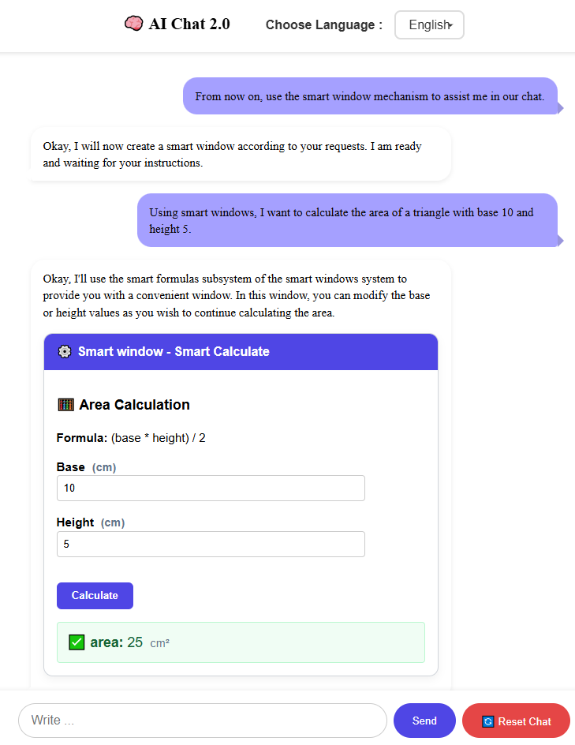

# AI-Chat 2.0 / Smart Windows / Smart Calculate

It's time to bring a fresh perspective to AI conversations with AI-Chat 2.0, which is fundamentally activated by its smart computation structure.


## 🤖 AI Model

This project integrates a custom-tuned model hosted on Hugging Face:

- 🔗 **Base Model:** (test model / seed=3407 /only english) [yakupc55/gemma3-1b-Smart-Windows-gguf](https://huggingface.co/yakupc55/gemma3-1b-Smart-Windows-gguf)
- 📊 **Dataset:** (test dataset / only 6 datas) [yakupc55/smart-windows](https://huggingface.co/datasets/yakupc55/smart-windows)

## 🚀 Features

- 🧠 AI-powered smart windows
- LM Studio api connection

## 🛠️ Technologies

- [Svelte](https://svelte.dev/)
- JavaScript

## 📦 Installation

```bash
# Clone the repository
git clone https://github.com/yourusername/ai-chat-2.0.git
cd ai-chat-2.0

# Install dependencies
npm install

# Run the development server
npm run dev
